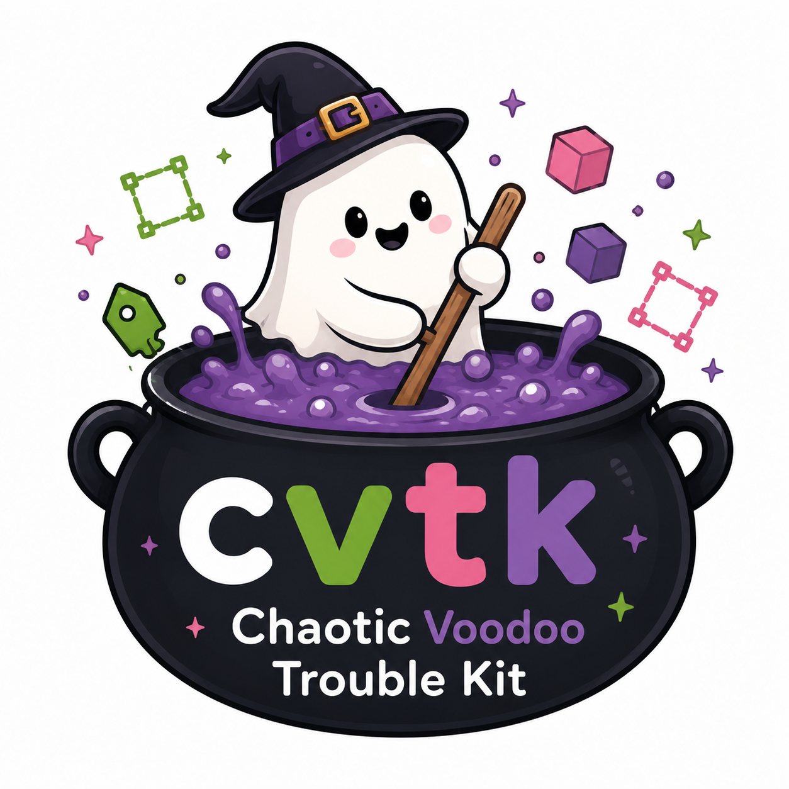

cvtk — Chaotic Voodoo Trouble Kit
#################################

**CVTK** used to stand for **Computer Vision Toolkit**.
Unfortunately, *cvtk* turned out to be a surprisingly common abbreviation,
so we did the only sensible thing:
instead of changing the acronym,
we changed what it stands for.

**Chaotic Voodoo Trouble Kit**,
a trouble kit powered by chaos and voodoo magic.

Behind the questionable name is a practical toolkit that provides easy-to-use command-line
tools for common computer vision tasks. With **cvtk**, you can perform object classification,
object detection, instance segmentation, and related operations with minimal setup.

The toolkit is built on top of well-known libraries such as
`PyTorch <https://pytorch.org/>`_ and
`OneDL MMDetection <https://onedl-mmdetection.readthedocs.io/>`_,
while hiding much of their complexity behind a clean and consistent interface.
It is designed for users who want to train, evaluate, and deploy vision models without
having to build an entire pipeline from scratch.

- `Documentation <https://cvtk.readthedocs.io/en/latest/index.html>`_
- `PyPI <https://pypi.org/project/cvtk/>`_
- `GitHub <https://github.com/bitdessin/cvtk>`_

Documentation
#############

.. toctree::
    :maxdepth: 2

    installation
    tutorials
    api

