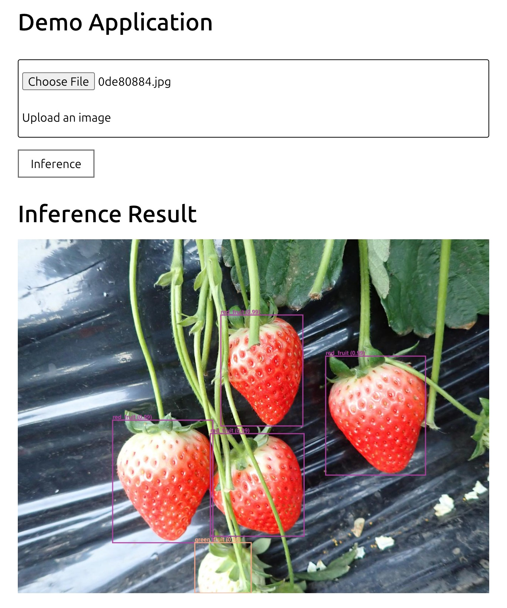

Web Application
###############

This tutorial explains how to use models built with the **cvtk** package in a web application.
The web application is built using **FastAPI**, a fast and simple web framework.
Therefore, before executing this tutorial, please install **FastAPI** and **Uvicorn**:

.. code-block:: sh

    pip install fastapi uvicorn

Object Classification
*********************

This section explains the steps to build a web application for an object classification model.
First, refer to the :doc:`object classification tutorial <cls>` to build the model.
Assume the source code for object classification generated by **cvtk** (using ResNet18 by default) is saved in :file:`cls.py`,
and the trained model's weights are saved in :file:`./outputs/fruits.pth`.

To generate the source code for the web application, execute the following command.
Specify a project name of your choice for ``--project``.
This command will create a directory with the specified project name and generate the web application's source code within it.
Next, specify the object classification source code generated by **cvtk** with ``--source``,
the label file used for training the classification model with ``--label``,
the model name (default is ResNet18) with ``--model``,
and the trained model's weights file with ``weights``.

.. code-block:: sh
    
    cvtk app --project clsapp \
       --source cls.py \
       --label ./data/fruits/label.txt \
       --model resnet18 \
       --weights ./output/fruits.pth

If the command runs successfully, a directory named clsapp will be created,
containing the web application's source code.
Next, navigate to the clsapp directory and execute the following command to start the **FastAPI** server:

.. code-block:: sh

    uvicorn main:app --host 0.0.0.0 --port 8080
    

You can now access the object classification model through a web page by visiting http://localhost:8080.

Additionally, you can modify the object classification source code to be independent of the **cvtk** package.
In that case, specify the ``--vanilla`` option when executing the ``cvtk app`` command:

.. code-block:: sh
    
    cvtk create --script cls.py --task cls --vanilla

    # train the model with cls.py

    cvtk app --project clsapp \
       --source cls.py \
       --label ./data/fruits/label.txt \
       --model resnet18 \
       --weights ./output/fruits.pth \
       --vanilla

Object Detection and Instance Segmentation
******************************************

The process for building a web application for object detection and instance segmentation models
is identical to that for object classification.
First, refer to the :doc:`object detection <det>` or :doc:`instance segmentation <segm>` tutorials
to build and save the trained model's weights.
Then, use the source code generated by **cvtk** to generate the web application's source code.
For object detection models, specify ``--task det``,
and for instance segmentation models, specify ``--task segm``.

For example, for an object detection model, execute the following:

.. code-block:: sh

    cvtk app --project detapp \
        --source det.py \
        --label ./data/strawberry/label.txt \
        --model ./output/strawberry.py \
        --weights ./output/strawberry.pth

For an instance segmentation model, execute the following:

.. code-block:: sh

    cvtk app --project segmapp \
        --source segm.py \
        --label ./data/strawberry/label.txt \
        --model ./output/strawberry.py \
        --weights ./output/strawberry.pth

Once the web application's source code is generated,
start the FastAPI server by executing the following command.
You can then access the object detection or instance segmentation model
through a web page by visiting http://localhost:8080.

.. code-block:: sh

    uvicorn main:app --host 0.0.0.0 --port 8080

If you want to generate source code that is independent of the **cvtk** package,
specify the ``--vanilla`` option when executing the ``cvtk app`` command:

.. code-block:: sh

    cvtk app --project detapp \
        --source det.py \
        --label ./data/strawberry/label.txt \
        --model ./output/strawberry.py \
        --weights ./output/strawberry.pth \
        --vanilla

