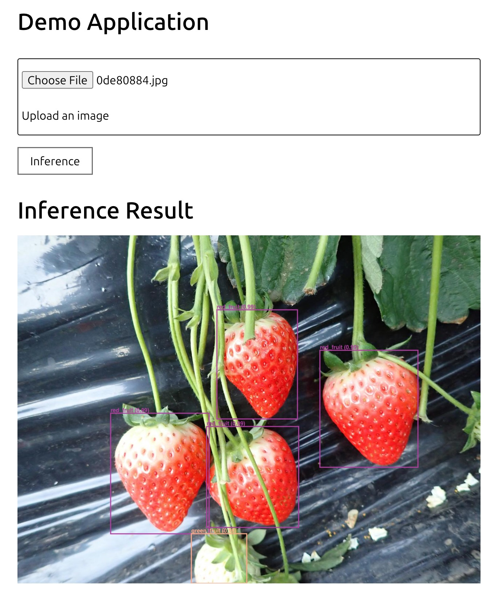

Web Application
###############

Models for object classification, detection, or instance segmentation
can also be deployed as a web application.
The **cvtk** package provides commands to easily generate example code for this purpose.

Object Classification
*********************

First, refer to the :doc:`object classification tutorial <cls>` to build and train a model.
Assume the source code for object classification
generated by **cvtk** (using ResNet18 by default) is saved as :file:`cls.py`,
and the trained model's weights are saved in :file:`./outputs/fruits.pth`.

Then, follow the steps below to create a web application for the object classification model.

The ``cvtk deploy-demoapp`` command is used to generate the source code for the web application.
This command requires the following arguments:

- ``--app_name``: The name of the project. A directory with this name will be created to store the web application source code.
- ``--script_name``: The source code file (e.g., :file:`cls.py`) generated by **cvtk** for object classification.
- ``--label``: The label file used for training the classification model.
- ``--weights``: The trained weights file (e.g., :file:`./outputs/fruits.pth`) of the classification model.

.. code-block:: sh
    
    cvtk deploy-demoapp \
        --app_name fruits_cls_app \
        --script_name cls.py \
        --label ./data/fruits/label.txt \
        --weights ./outputs/fruits.pth

If the command runs successfully, a directory named :file:`fruits_cls_app` will be created,
and source code files for the web application will be generated in it.
Next, execute the following command to start the web application server:

.. code-block:: sh

    cd fruits_cls_app
    gunicorn --bind 0.0.0.0:8080 main:app

You can now access the object classification model through a web browser at
`http://localhost:8080 <http://localhost:8080>`_.

Additionally,
you can also modify the object classification source code
to be independent of the **cvtk** package.  
In this case, generate the model script with ``--vanilla``.
Note that the object classification source code itself must also be generated with the ``--vanilla`` option.

.. code-block:: sh
    
    cvtk deploy-model --script_name cls.py --backend torch --task cls --vanilla

    # train the model with cls.py

    cvtk deploy-demoapp \
        --app_name fruits_cls_app \
        --script_name cls.py \
        --label ./data/fruits/label.txt \
        --weights ./outputs/fruits.pth

Object Detection
****************

First, refer to the :doc:`object detection tutorial <det>` to build and train a detection model.  
Assume the detection source code generated by **cvtk** is saved as :file:`det.py`,  
and the trained model's weights are saved in :file:`./outputs/strawberry.pth`.
For MMDetection models, keep the generated config file
(:file:`./outputs/strawberry.py`) next to the weights file.

Then, generate the web application source code with the following command.

.. code-block:: sh
    
    cvtk deploy-demoapp \
        --app_name strawberry_detapp \
        --script_name det.py \
        --label ./data/strawberry/label.txt \
        --weights ./outputs/strawberry.pth

This will create a directory named :file:`strawberry_detapp`,
containing the web application source code.
Next, you can start the web application server as follows.

.. code-block:: sh

    cd strawberry_detapp
    gunicorn --bind 0.0.0.0:8080 main:app

Now, you can access the object detection model through a web browser at
`http://localhost:8080 <http://localhost:8080>`_.

.. note::

    If MMDetection detection or segmentation checkpoint loading fails with a PyTorch ``weights_only`` error
    for a checkpoint that you created and trust, start the server with
    ``TORCH_FORCE_NO_WEIGHTS_ONLY_LOAD=1``.
    For example:

    .. code-block:: sh

        TORCH_FORCE_NO_WEIGHTS_ONLY_LOAD=1 gunicorn --bind 0.0.0.0:8080 main:app

As with classification, the detection model can also be deployed without depending on **cvtk**.
First, generate detection source code with the ``--vanilla`` option, train the model,
and then generate the web application with ``cvtk deploy-demoapp``.

.. code-block:: sh
    
    cvtk deploy-model --script_name det.py --backend mmdet --task det --vanilla

    # train the model with det.py

    cvtk deploy-demoapp \
        --app_name strawberry_detapp \
        --script_name det.py \
        --label ./data/strawberry/label.txt \
        --weights ./outputs/strawberry.pth

Instance Segmentation
*********************

First, refer to the :doc:`instance segmentation tutorial <segm>` to build and train a segmentation model.
Assume the segmentation source code generated by **cvtk** is saved as :file:`segm.py`,  
and the trained model's weights are saved in :file:`./outputs/strawberry.pth`.
For MMDetection models, keep the generated config file
(:file:`./outputs/strawberry.py`) next to the weights file.

Next, generate the web application source code with the following command.

.. code-block:: sh
    
    cvtk deploy-demoapp \
        --app_name strawberry_segmapp \
        --script_name segm.py \
        --label ./data/strawberry/label.txt \
        --weights ./outputs/strawberry.pth

This will create a directory named :file:`strawberry_segmapp`,
containing the web application source code.
Then, start the web application server as follows.

.. code-block:: sh

    cd strawberry_segmapp
    gunicorn --bind 0.0.0.0:8080 main:app

You can now access the instance segmentation model through a web browser at
`http://localhost:8080 <http://localhost:8080>`_.

To deploy the segmentation model without relying on **cvtk**,
first generate the segmentation source code with ``--vanilla``,
train the model, and then generate the web application with ``cvtk deploy-demoapp``.

.. code-block:: sh
    
    cvtk deploy-model --script_name segm.py --backend mmdet --task segm --vanilla

    # train the model with segm.py

    cvtk deploy-demoapp \
        --app_name strawberry_segmapp \
        --script_name segm.py \
        --label ./data/strawberry/label.txt \
        --weights ./outputs/strawberry.pth
