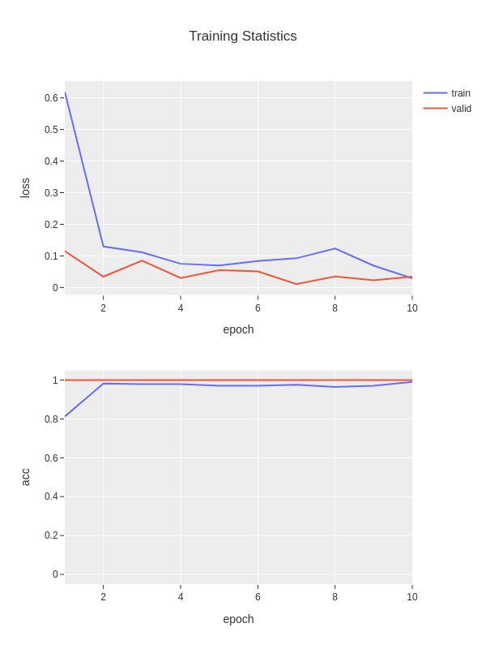
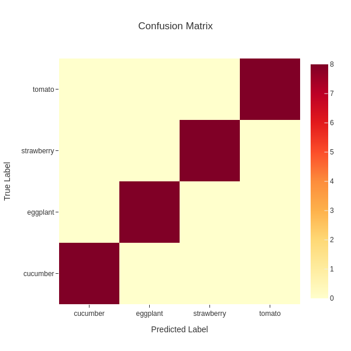

Object Classification
#####################

This tutorial describes how to use the **cvtk** package
to build a model of an object classification task,
from training the to inference.

.. note::

    The **cvtk** package internally calls functions implemented in
    the **torch** (`PyTorch <https://pytorch.org/>`_) and **torchvision** packages
    for object classification tasks.
    Ensure that **PyTorch** is installed correctly without any errors
    before using the **cvtk** package.

    .. code-block:: python

        import torch
        import torchvision
        print(torch.__version__)
        print(torchvision.__version__)

Source Code Preparation
***********************

User can import **cvtk** package to build and train a model
for object classification tasks and use the model for inference
by refering to the **cvtk** package documentation.
Alternatively, to get the quick start,
user can generate an example Python source code using the ``cvtk`` command.

The source code for object classification tasks
can be generated by ``cvtk create`` command with the ``--task cls`` argument.
For those new to programming or deep learning,
it is recommended to run the command with default options.
It generates simple source code that contains only the essential processes,
with all complex processes imported from the **cvtk** package.
This makes the source code easy to read and helps in
understanding the flow of deep learning for beginners.

.. code-block:: sh
    
    cvtk create --script cls.py --task cls

After running the command, the source code will be generated in the file :file:`cls.py`.
By default, the network architecture ResNet18 (``torchvision.models.resnet18``) is used.
User can change the ``resnet18`` to other keywords to use different network architectures
by editing :file:`cls.py`.
The available network architectures can be found on the PyTroch website
(e.g., `Models and pre-trained weights <https://pytorch.org/vision/main/models.html>`_).

Additionally, for those who are already familiar with deep learning,
it is recommended to run the command with the additional argument ``--vanilla``.
It generates source code that uses only the **PyTorch** package functions.
Users can then customize the source code to suit their needs,
for example, adding data augmentation processes and changing optimization algorithms.

.. code-block:: sh
    
    cvtk create --script cls.py --task cls --vanilla

Model Training and Validation
*****************************

To train the model, open the source code generated above and execute it by providing training,
validation, and test data to the input of the ``train`` function.

Alternatively, the source code can be executed directly from the command line as follows:

.. code-block:: sh

    python cls.py train \
        --label ./data/fruits/label.txt \
        --train ./data/fruits/train.txt \
        --valid ./data/fruits/valid.txt \
        --test ./data/fruits/test.txt \
        --output_weights ./outputs/fruits.pth

The weights of the trained model will be saved in :file:`fruits.pth`,
and the loss and accuracy data during the training process will be saved in
:file:`fruits.train_stats.txt` and showed in figure :file:`fruits.train_stats.png`.
The file :file:`fruits.train_stats.txt` is a tab-separated file
consiting of five columns: epoch, train_loss, train_acc, valid_loss, and vlaid_acc,
as follows:

::

    epoch  train_loss  train_acc  valid_loss  valid_acc
    1      1.40679     0.22368    1.24780     0.41667
    2      1.21213     0.48684    1.09401     0.83334
    3      1.00425     0.81578    0.88967     0.83334
    4      0.78659     0.82894    0.64055     0.91666
    5      0.46396     0.96052    0.39010     0.91666

Additionally, if the test data is provided,
the model will be evaluated using the test data.
The test results will be saved in :file:`fruits.test_outputs.txt`
and confusion matrix will be saved in :file:`fruits.test_outputs.cm.txt`
and :file:`fruits.test_outputs.cm.png`.

The file :file:`fruits.test_outputs.txt` is a tab-separated file,
where the first column is the path to the image,
the second column is the true label,
and the following columns are the predicted probabilities for each class.

::

    # loss: 0.021113455295562744
    # acc: 0.944932234
    image         label       cucumber  eggplant  strawberry  tomato
    44a0ceae.jpg  cucumber    0.97071	0.00400   0.01282     0.01248
    4b0249f4.jpg  cucumber    0.81493	0.09675   0.04698     0.04134
    14c6e557.jpg  strawberry  0.00000   0.00028   0.99940     0.00032
    18174d63.jpg  strawberry  0.00000   0.00045   0.99904     0.00051
    2a43e151.jpg  tomato      0.00004	0.00119   0.00404     0.99473
    35235e30.jpg  eggplant    0.00000   1.00000   0.00000     0.00000
    667a045f.jpg  cucumber    0.96733   0.00430   0.01193     0.01644
    ...

The file :file:`fruits.test_outputs.cm.txt` is a tab-separated file,
representing a confusion matrix of test data.
The class labels shown in the header are the predicted labels
while the class labels shown in the first column are the ground truth.

::

    # Confusion Matrix
    #	prediction
        cucumber	eggplant	strawberry	tomato
    cucumber	8	0	0	0
    eggplant	0	8	0	0
    strawberry	0	0	8	0
    tomato	0	0	0	8

The file :file:`fruits.test_outputs.cm.png` is a figure showing
the confusion matrix.

Inference
*********

To perform inference using the constructed model,
refer to the ``inference`` function in the source code.

Alternatively, it can also be executed directly from the command line as follows:

.. code-block:: sh

    python cls.py inference \
        --label ./data/fruits/label.txt \
        --data ./data/fruits/test.txt \
        --model_weights ./outputs/fruits.pth \
        --output ./outputs/fruits.inference_results.txt

The inference results will will be saved in :file:`fruits.inference_results.txt`.
The file is a tab-separated file,
where the first column is the path to the image,
the second column is the predicted label,
and the following columns are the predicted probabilities for each class.

::
    
    image         prediction  cucumber	eggplant  strawberry  tomato
    44a0ceae.jpg  cucumber    0.99384   0.00226   0.00081     0.00308
    14c6e557.jpg  strawberry  0.00000   0.00003   0.99965     0.00032
    c937b2d9.jpg  eggplant    0.00177   0.99704   0.00031     0.00088
    1fd32b2f.jpg  eggplant    0.00001   0.99994   0.00003     0.00000
    cad59952.jpg  tomato      0.00000   0.00000   0.00001     0.99999

