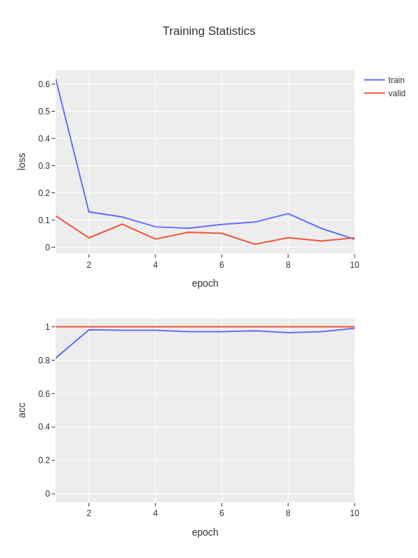
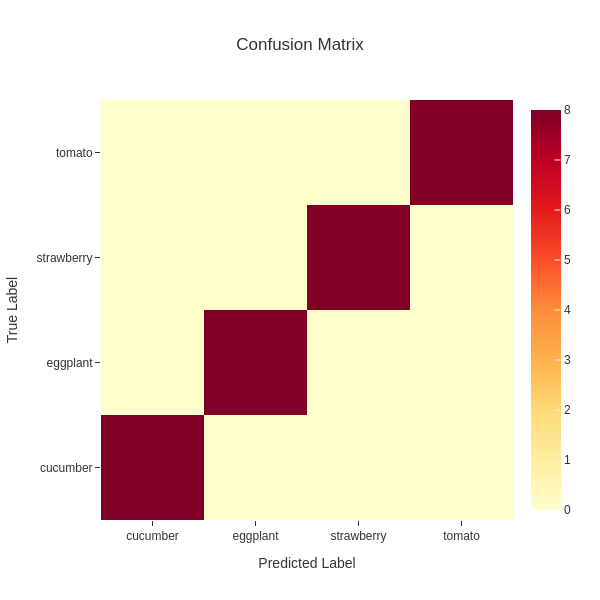

Object Classification
#####################

This tutorial describes how to use the **cvtk** package
to build and train a model for an object classification task,
covering the process from training to inference.

.. note::

    The **cvtk** package internally uses functions from
    the **torch** (`PyTorch <https://pytorch.org/>`_)
    and **torchvision** packages for object classification.
    Make sure that **PyTorch** and **torchvision**
    are installed correctly before using **cvtk**.

    .. code:: python

        import torch
        import torchvision
        print(f"torch {torch.__version__}")
        print(f"torchvision {torchvision.__version__}")

Preparation
***********

Users can write the source code for object classification from scratch
using a few functions provided by the **cvtk** package.
However, for those new to programming or deep learning,
it is recommended to first use the ``cvtk deploy-model`` command
to generate an example script and then modify it as needed.

.. code-block:: sh
    
    cvtk deploy-model --script_name cls.py --backend torch --task cls

This command generates a simple source code file named :file:`cls.py`
that contains only the essential processes,
with all complex functionality imported from the **cvtk** package.
This makes the source code easy to read
and helps beginners understand the flow of a deep learning workflow.

By default, the network architecture ResNet18 (``torchvision.models.resnet18``) is used.
Users can change ``resnet18`` to other available architectures by editing :file:`cls.py`.
A list of available architectures and pre-trained models can be found on the PyTorch website:
`Models and pre-trained weights <https://pytorch.org/vision/main/models.html>`_.

For users already familiar with deep learning,
it is recommended to run the command with the additional ``--vanilla`` argument.
This generates source code that uses only **torch** functions, without relying on **cvtk**.
This approach produces a script that can be shared with others who do not have **cvtk** installed,
or customized further,
for example, by adding data augmentation or changing optimization algorithms.

.. code-block:: sh
    
    cvtk deploy-model --script_name cls.py --backend torch --task cls --vanilla

Model Training and Validation
*****************************

The source code :file:`cls.py` generated above
can be used to train an object classification model
by running it with the appropriate arguments.

For example, if the training, validation, and test data are listed
in :file:`train.txt`, :file:`valid.txt`, and :file:`test.txt` respectively,
and the class labels are listed in :file:`label.txt`,
the model can be trained using the following command.

.. code-block:: sh

    python cls.py train \
        --label ./data/fruits/label.txt \
        --train ./data/fruits/train.txt \
        --valid ./data/fruits/valid.txt \
        --test ./data/fruits/test.txt \
        --output_weights ./outputs/fruits.pth

The trained model weights will be saved in :file:`fruits.pth`.
During training, the loss and accuracy metrics will be saved in :file:`fruits.train_stats.txt`
and visualized in :file:`fruits.train_stats.png`.
The file :file:`fruits.train_stats.txt` is a tab-separated file with five columns:
``epoch``, ``train_loss``, ``train_acc``, ``valid_loss``, and ``valid_acc``.

::

    epoch  train_loss  train_acc  valid_loss  valid_acc
    1      1.40679     0.22368    1.24780     0.41667
    2      1.21213     0.48684    1.09401     0.83334
    3      1.00425     0.81578    0.88967     0.83334
    4      0.78659     0.82894    0.64055     0.91666
    5      0.46396     0.96052    0.39010     0.91666

In addition, the model will be evaluated on the test data when it is available.
Test results will be saved in :file:`fruits.test_outputs.txt`,
and the confusion matrix will be saved in :file:`fruits.test_outputs.cm.txt` and :file:`fruits.test_outputs.cm.png`.
The file :file:`fruits.test_outputs.txt` is tab-separated,
with the first column as the image path,
the second column as the true label, and the following columns as predicted probabilities for each class.

::

    # loss: 0.021113455295562744
    # acc: 0.944932234
    image         label       cucumber  eggplant  strawberry  tomato
    44a0ceae.jpg  cucumber    0.97071	0.00400   0.01282     0.01248
    4b0249f4.jpg  cucumber    0.81493	0.09675   0.04698     0.04134
    14c6e557.jpg  strawberry  0.00000   0.00028   0.99940     0.00032
    ...

The file :file:`fruits.test_outputs.cm.txt` represents a confusion matrix. 
Columns correspond to predicted labels, and rows correspond to ground-truth labels.

::

    # Confusion Matrix
    #	prediction
        cucumber	eggplant	strawberry	tomato
    cucumber	8	0	0	0
    eggplant	0	8	0	0
    strawberry	0	0	8	0
    tomato	0	0	0	8

If validation or test data are not available,
the model can still be trained using only the training data.

.. code-block:: sh

    python cls.py train \
        --label ./data/fruits/label.txt \
        --train ./data/fruits/train.txt \
        --output_weights ./outputs/fruits.pth

In addition, this script also supports resuming training from the previously trained weights.
Specify the path to the pretrained weights using the ``--input_weights`` argument as follows.

.. code-block:: sh

    python cls.py train \
        --label ./data/fruits/label.txt \
        --train ./data/fruits/train.txt \
        --valid ./data/fruits/valid.txt \
        --test ./data/fruits/test.txt \
        --input_weights ./outputs/fruits.pth \
        --output_weights ./outputs/fruits_v2.pth

Users can also customize various training parameters
such as the number of epochs, batch size, and optimization algorithm
by editing the default values in the ``train`` function inside :file:`cls.py`.

Inference
*********

Running :file:`cls.py` with the ``inference`` argument
allows users to perform inference using a trained model.
For inference, the label file, input images, trained model weights,
and the output file path for storing the inference results must be specified.
The input images should be specified with the ``--data`` argument,
which can be either a text file containing image paths (one path per line)
or a directory containing images.

.. code-block:: sh

    python cls.py inference \
        --label ./data/fruits/label.txt \
        --data ./data/fruits/test.txt \
        --model_weights ./outputs/fruits.pth \
        --output ./outputs/fruits.inference_results.txt

In this example, the inference results **will be saved** in :file:`fruits.inference_results.txt`.
The file is tab-separated, with the first column as the image path,
the second column as the predicted label,
and the following columns as the predicted probabilities for each class.

::

    image         prediction  cucumber	eggplant  strawberry  tomato
    44a0ceae.jpg  cucumber    0.99384   0.00226   0.00081     0.00308
    14c6e557.jpg  strawberry  0.00000   0.00003   0.99965     0.00032
    c937b2d9.jpg  eggplant    0.00177   0.99704   0.00031     0.00088
    1fd32b2f.jpg  eggplant    0.00001   0.99994   0.00003     0.00000
    cad59952.jpg  tomato      0.00000   0.00000   0.00001     0.99999
