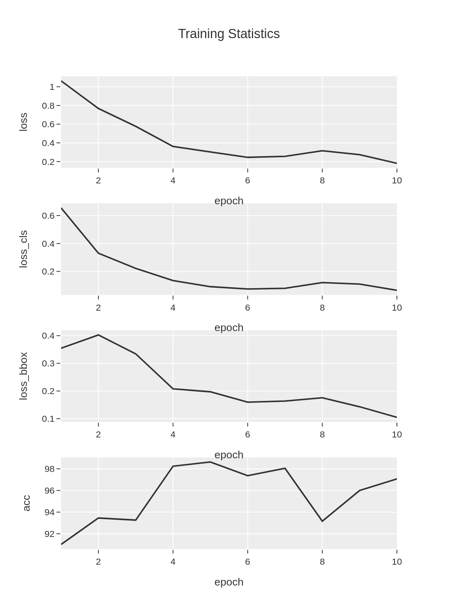
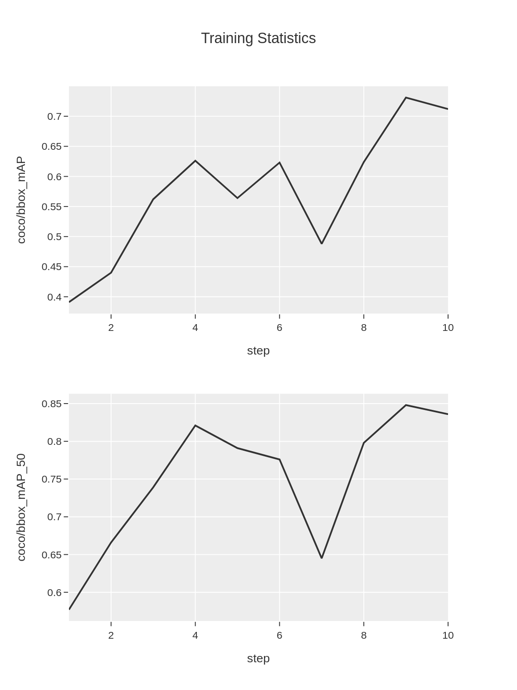
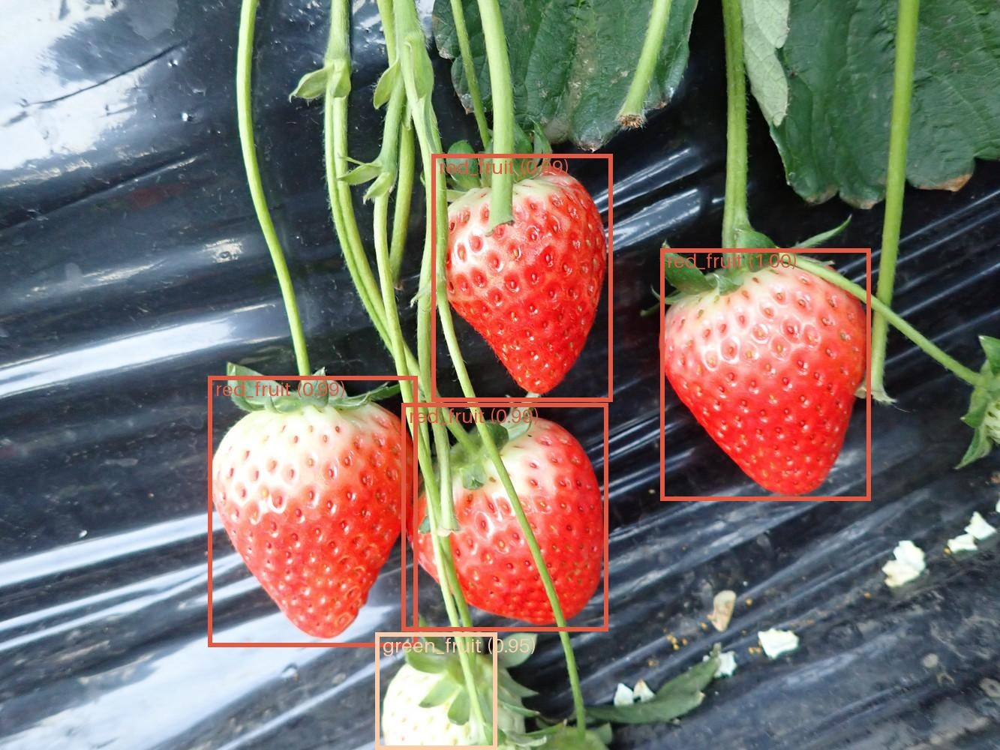
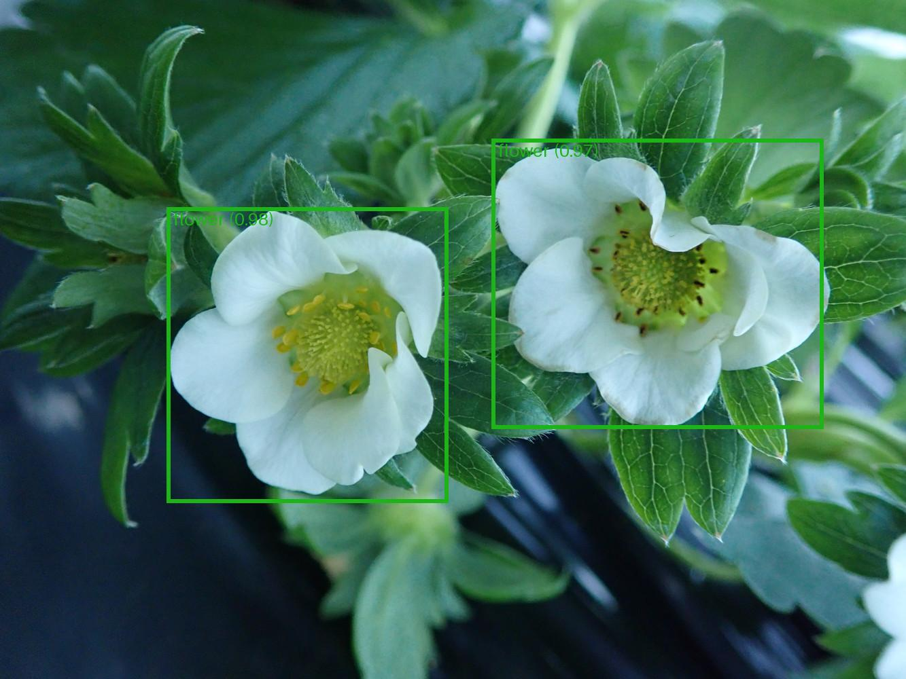

Object Detection
################

Object detection combines classification and localization
to locate objects in an image through bounding boxes.
This tutorial describes how to use the **cvtk** package
to build a model of an object detection task,
from training the to inference.

.. note::

    The **cvtk** package internally calls functions implemented in
    the **torch** (`PyTorch <https://pytorch.org/>`_),
    **mmcv** (`MMCV <https://mmcv.readthedocs.io/en/latest/>`_),
    and **mmdet** (`MMDetection <https://mmdetection.readthedocs.io/en/latest/>`_) packages
    for object detection tasks.
    Ensure that **torch**, **mmdet**, and **mmcv** is installed correctly without any errors
    before using the **cvtk** package.

    .. code-block:: python

        import torch
        import mmcv
        import mmdet
        print(torch.__version__)
        print(mmcv.__version__)
        print(mmdet.__version__)

Source Code Preparation
***********************

To generate Python source code,
use the ``cvtk create`` command.
For those new to programming or deep learning,
it is recommended to run the following command to generate simple source code.
The code generated by this command contains only the essential processes,
with all complex processes imported from the **cvtk** package.
This makes the source code easy to read and helps in
understanding the flow of deep learning for beginners.

.. code-block:: sh
    
    cvtk create --script det.py --task det

By default, Faster RCNN (``faster-rcnn_r101_fpn_1x_coco``) is used.
Users can change the ``'faster-rcnn_r101_fpn_1x_coco'`` part to any other network architecture
by replacing it with another string in the generated source code.
Available network architectures can be found on the MMDet GitHub repository
(e.g., `mmdetection.configs <https://github.com/open-mmlab/mmdetection/tree/main/configs>`_)
or search by using the ``mim search`` command (e.g., ``mim search mmdet --model "r-cnn"``).

For those who are already familiar with deep learning,
it is recommended to run the following command
(``cvtk create`` with the argument ``--vanilla``)
to generate source code that uses only the **MMDetection** package functions.
Users can then customize the source code generated by this command to suit their needs.
For example, users can add various processes
such as data augmentation, optimization algorithms, and loss functions.

.. code-block:: sh
    
    cvtk create --script det.py --task det --vanilla

Model Training and Validation
*****************************

To train the model, open the source code generated above and execute it by providing training,
validation, and test data to the input of the ``train`` function.

Alternatively, the source code can be executed directly from the command line as follows:

.. code-block:: sh

    python det.py train \
        --label ./data/strawberry/label.txt \
        --train ./data/strawberry/train/bbox.json \
        --valid ./data/strawberry/valid/bbox.json \
        --test ./data/strawberry/test/bbox.json \
        --output_weights ./outputs/strawberry.pth

The weights of the trained model will be saved in :file:`strawberry.pth`,
and the loss and accuracy data during the training process will be saved in
:file:`strawberry.train_stats.train.txt` and :file:`strawberry.train_stats.valid.txt`
and the figures based on the two file.
Both files are tab-separated files as follows:

:file:`strawberry.train_stats.train.txt`

::

    epoch	lr	data_time	loss	loss_rpn_cls	loss_rpn_bbox	loss_cls	acc	loss_bbox	time	memory
    1	0.0011811623246492983	0.012568799654642741	1.0270314663648605	0.030940301870577967	0.019437399141800902	0.64003709902366	87.109375	0.3366166626413663	0.294748592376709	5539.0
    2	0.0023823647294589174	0.002985730171203613	0.7621045112609863	0.018117828631657177	0.014595211343839764	0.33093497216701506	86.328125	0.39845649629831315	0.2621237087249756	5539.0
    3	0.003583567134268537	0.0030106496810913086	0.5718079897761345	0.007945213937782683	0.012842701384797692	0.2135572835057974	90.8203125	0.33746279165148735	0.25948814868927	5540.0
    4	0.004784769539078155	0.002938108444213867	0.3803089389204979	0.004043563161249039	0.012852981882169844	0.13384666815400123	98.828125	0.22956572577357293	0.25895278453826903	5539.0
    5	0.005985971943887774	0.003097343444824219	0.3158286053687334	0.0028303257742663844	0.012002748951781541	0.10025690719485283	98.33984375	0.20073862358927727	0.2683125925064087	5540.0

:file:`strawberry.train_stats.train.png`

:file:`strawberry.train_stats.valid.txt`

::

    coco/bbox_mAP	coco/bbox_mAP_50	coco/bbox_mAP_75	coco/bbox_mAP_s	coco/bbox_mAP_m	coco/bbox_mAP_l	data_time	time	step
    0.324	0.444	0.37	0.0	-1.0	0.345	0.07410950660705566	0.1943049907684326	1
    0.36	0.572	0.377	0.0	-1.0	0.379	0.005773027737935384	0.12345961729685466	2
    0.587	0.8	0.708	0.0	-1.0	0.608	0.0052491029103597	0.12246429920196533	3
    0.608	0.829	0.78	0.0	-1.0	0.63	0.005251884460449219	0.12280686696370442	4
    0.583	0.817	0.807	0.0	-1.0	0.606	0.008228460947672525	0.1374462048212687	5

:file:`strawberry.train_stats.valid.png`

Additionally, if the test data is provided,
the model will be evaluated using the test data.
The inference results of test data are stored in workspace (:file:`strawberry` directory)
with the name :file:`test_outputs.coco.json` in COOC format file.
The test performance metrics (e.g., mAP) will be saved in :file:`strawberry.test_stats.json`
in JSON format as follows.
The ``stats`` element indicates the mean of metrics of all classes,
while the metrics for each class are stored in ``class_stats`` elements.

::

    {
        "stats": {
            "AP@[0.50:0.95|all|100]": 0.8671538582429673,
            "AP@[0.50|all|1000]": 0.9365079365079365,
            "AP@[0.75|all|1000]": 0.9365079365079365,
            ...
            "AP@[0.50:0.95|large|1000]": 0.8671538582429673,
            "AR@[0.50:0.95|all|100]": 0.4738095238095238,
            "AR@[0.50:0.95|all|300]": 0.9029761904761905,
        },
        "class_stats": {
            "flower": {
                "AP@[0.50:0.95|all|100]": 0.9252475247524753,
                "AP@[0.50|all|1000]": 1.0,
                "AP@[0.75|all|1000]": 1.0,
                ...
            },
            "green_fruit": {
                "AP@[0.50:0.95|all|100]": 0.9665016501650165,
                "AP@[0.50|all|1000]": 1.0,
                "AP@[0.75|all|1000]": 1.0,
                ...
            },
            "red_fruit": {
                "AP@[0.50:0.95|all|100]": 0.7097123998114098,
                "AP@[0.50|all|1000]": 0.8095238095238095,
                "AP@[0.75|all|1000]": 0.8095238095238095,
                ...
            }
        }
    }

Inference
*********

To perform inference using the constructed model,
refer to the ``inference`` function in the source code.

Alternatively, it can also be executed directly from the command line as follows:

.. code-block:: sh

    python det.py inference \
        --label ./data/fruits/label.txt \
        --data ./data/fruits/test.txt \
        --model_weights ./outputs/strawberry.pth \
        --output ./outputs/inference_results

The inference result of each image
(i.e., image with predicted bounding boxes)
will be saved in :file:`inference_results` directory.
Additionanly, a COCO format file containing all predicted annotations
will be saved in :file:`instances.json`

Example of outputed images are:

