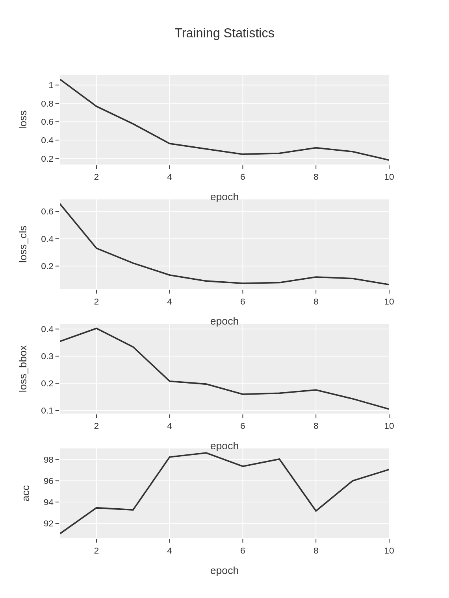
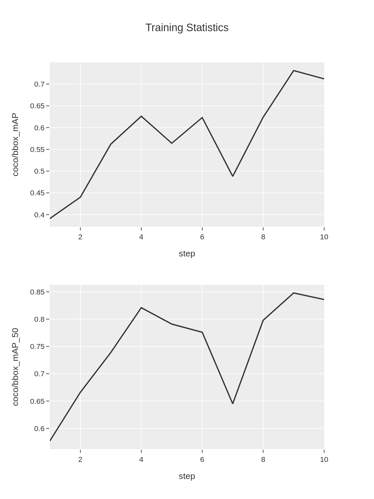
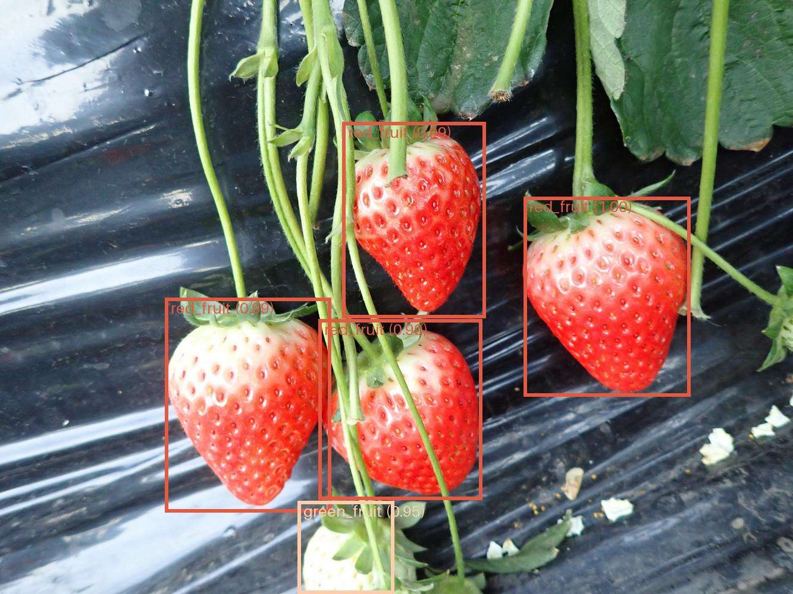
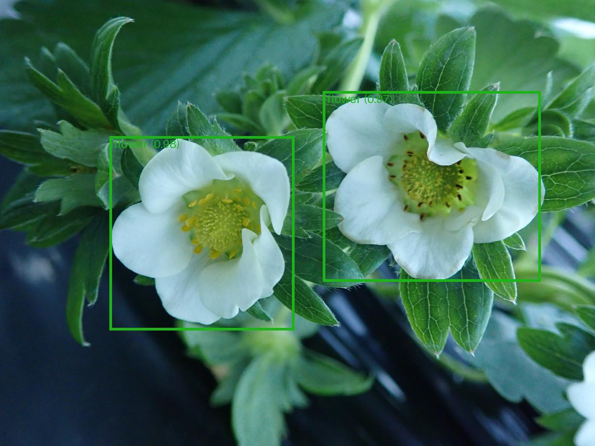

Object Detection
################

Object detection combines classification and
localization to locate objects in an image using bounding boxes.
This tutorial describes how to use the **cvtk** package
to build and train an object detection model, covering the process from training to inference.

.. note::

    The **cvtk** package internally uses functions from
    **torch** (`PyTorch <https://pytorch.org/>`_),
    **mmcv** (`MMCV <https://mmcv.readthedocs.io/en/latest/>`_),
    and **mmdet** (`MMDetection <https://mmdetection.readthedocs.io/en/latest/>`_) packages
    for object detection tasks.
    Make sure that **torch**, **mmdet**, and **mmcv** are installed correctly
    without any errors before using **cvtk**.

    .. code:: python

        import torch
        import mmcv
        import mmdet
        print(f"torch {torch.__version__}")
        print(f"mmcv {mmcv.__version__}")
        print(f"mmdet {mmdet.__version__}")

Preparation
***********

The ``cvtk create`` command can generate a source code for detecting objects in images.

.. code-block:: sh
    
    cvtk create --script det.py --task det

This command generates a file named :file:`det.py`,
containing simple source code for object detection.
All complex functionality is imported from the **cvtk** package,
making the code easy to read and helping beginners understand the deep learning workflow.

By default, **Faster R-CNN** (``faster-rcnn_r101_fpn_1x_coco``) is used.
Users can change ``'faster-rcnn_r101_fpn_1x_coco'`` to another network architecture
by editing the generated source code.
Available architectures can be found on the MMDetection GitHub repository
(e.g., `mmdetection.configs <https://github.com/open-mmlab/mmdetection/tree/main/configs>`_)
or searched using the ``mim search`` command (e.g., ``mim search mmdet --model "faster-rcnn"``).

For users familiar with deep learning,
it is recommended to run ``cvtk create`` with the ``--vanilla`` argument.
This generates source code that uses only **torch** and **mmdet** functions,
without relying on **cvtk**.
The resulting script can be shared with others who do not have **cvtk** installed,
or customized further,
for example, by adding data augmentation or changing optimization algorithms.

.. code-block:: sh
    
    cvtk create --script det.py --task det --vanilla

Model Training and Validation
*****************************

Training and validation can be performed by executing the generated source code,
providing the training, validation, and test datasets along with the label file as follows.

.. code-block:: sh

    python det.py train \
        --label ./data/strawberry/label.txt \
        --train ./data/strawberry/train/bbox.json \
        --valid ./data/strawberry/valid/bbox.json \
        --test ./data/strawberry/test/bbox.json \
        --output_weights ./outputs/strawberry.pth

In this example, the weights of the trained model will be saved in :file:`strawberry.pth`.
The loss and accuracy data during training will be saved
in :file:`strawberry.train_stats.train.txt` and :file:`strawberry.train_stats.valid.txt`,
and figures based on these files will be generated.
Both text files are tab-separated, for example.

:file:`strawberry.train_stats.train.txt`

::

    epoch	lr	data_time	loss	loss_rpn_cls	loss_rpn_bbox	loss_cls	acc	loss_bbox	time	memory
    1	0.00118	0.01257	1.02703	0.03094	0.01944	0.64004	87.11	0.33662	0.29475	5539
    2	0.00238	0.00299	0.76210	0.01812	0.01460	0.33093	86.33	0.39846	0.26212	5539
    3	0.00358	0.00301	0.57181	0.00795	0.01284	0.21356	90.82	0.33746	0.25949	5540
    4	0.00478	0.00294	0.38031	0.00404	0.01285	0.13385	98.83	0.22957	0.25895	5539
    5	0.00599	0.00310	0.31583	0.00283	0.01200	0.10026	98.34	0.20074	0.26831	5540

:file:`strawberry.train_stats.train.png`

:file:`strawberry.train_stats.valid.txt`

::

    coco/bbox_mAP	coco/bbox_mAP_50	coco/bbox_mAP_75	coco/bbox_mAP_s	coco/bbox_mAP_m	coco/bbox_mAP_l	data_time	time	step
    0.324	0.444	0.37	0.0	-1.0	0.345	0.0741	0.1943	1
    0.36	0.572	0.377	0.0	-1.0	0.379	0.00577	0.12346	2
    0.587	0.8	0.708	0.0	-1.0	0.608	0.00525	0.12246	3
    0.608	0.829	0.78	0.0	-1.0	0.63	0.00525	0.12281	4
    0.583	0.817	0.807	0.0	-1.0	0.606	0.00823	0.13745	5

:file:`strawberry.train_stats.valid.png`

The model will be evaluated on the test dataset when test data are provided.
The test results will be saved in the workspace (:file:`strawberry` directory) as :file:`test_outputs.coco.json` in COCO format.
The test performance metrics (e.g., mAP) will be saved in :file:`strawberry.test_stats.json` in JSON format.
The ``stats`` element in the JSON format file contains the mean metrics across all classes,
while metrics for each class are stored in ``class_stats``.

::

    {
        "stats": {
            "AP@[0.50:0.95|all|100]": 0.867,
            "AP@[0.50|all|1000]": 0.937,
            ...
        },
        "class_stats": {
            "flower": { "AP@[0.50:0.95|all|100]": 0.925, ... },
            "green_fruit": { "AP@[0.50:0.95|all|100]": 0.967, ... },
            "red_fruit": { "AP@[0.50:0.95|all|100]": 0.710, ... }
        }
    }

If validation or test data are not available,
the model can still be trained using only the training dataset, as shown below.

.. code-block:: sh

    python det.py train \
        --label ./data/strawberry/label.txt \
        --train ./data/strawberry/train/bbox.json \
        --output_weights ./outputs/strawberry.pth

This script also supports resuming training from previously trained weights.  
Specify the path to the pretrained weights using the ``--input_weights`` argument, as follows.

.. code-block:: sh

    python det.py train \
        --label ./data/strawberry/label.txt \
        --train ./data/strawberry/train/bbox.json \
        --valid ./data/strawberry/valid/bbox.json \
        --test ./data/strawberry/test/bbox.json \
        --input_weights ./outputs/strawberry.pth \
        --output_weights ./outputs/strawberry_v2.pth

Users can also customize various training parameters,
such as the number of epochs, batch size,
and optimization algorithm, 
by editing the default values in the ``train`` function inside :file:`det.py`.

Inference
*********

Performing inference using the trained model can be done directly from the command line.
The target images should be specified with the ``--data`` argument,
which can be either a text file containing image paths (one path per line)
or a directory containing images.

.. code-block:: sh

    python det.py inference \
        --label ./data/fruits/label.txt \
        --data ./data/fruits/test.txt \
        --model_weights ./outputs/strawberry.pth \
        --output ./outputs/inference_results

The inference results for each image (i.e., images with predicted bounding boxes)
will be saved in the :file:`inference_results` directory.
Additionally, a COCO format file containing all predicted annotations
will be saved as :file:`instances.json`.
The following are examples of the output images.

