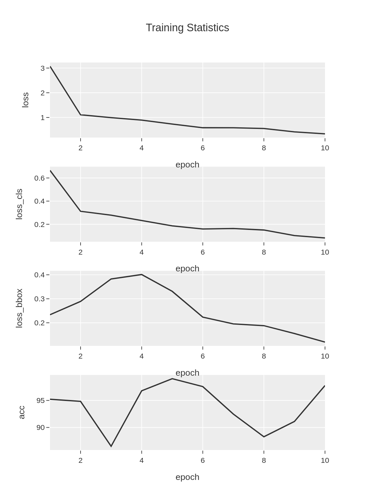
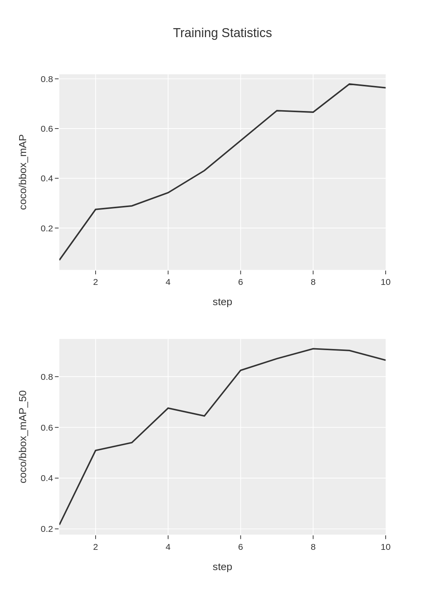
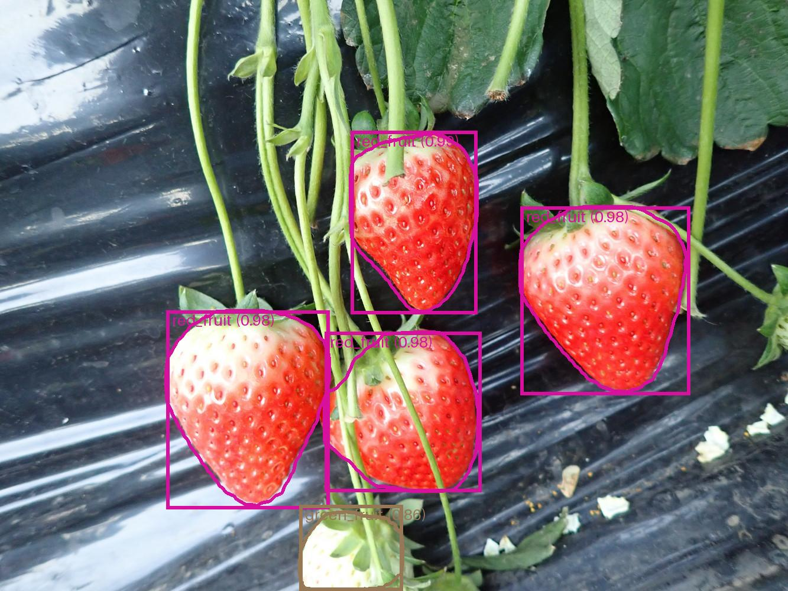
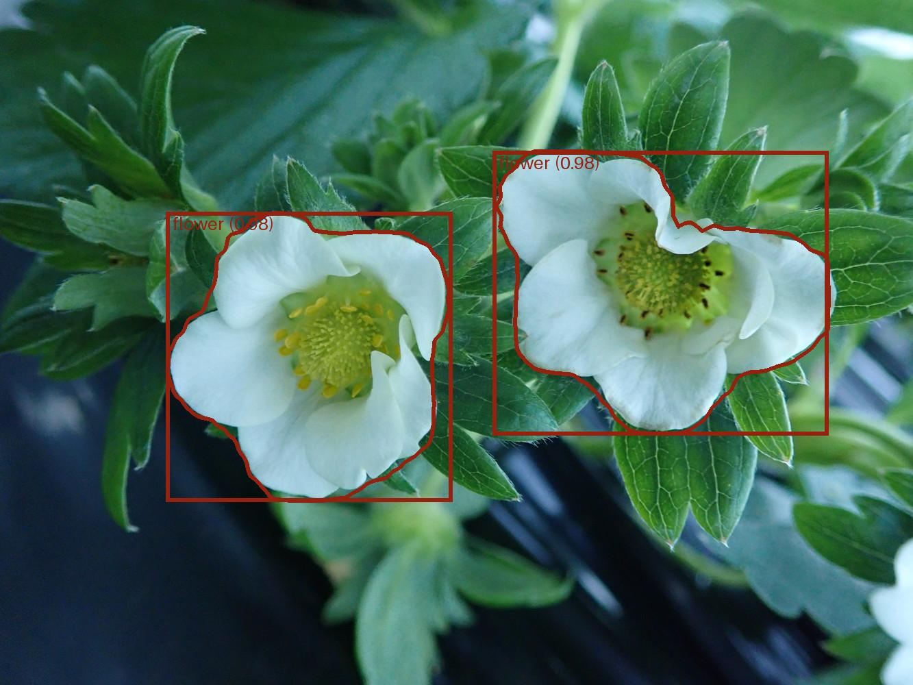

Instance Segmentation
#####################

Instance segmentation determines the pixelwise mask for each object in an image. 
This tutorial will guide you through creating source codes for instance segmentation tasks
using the **cvtk** package,
building a model for segmenting objects, and performing inference on the constructed model.

Note that the **MMDetection** package is internally used in **cvtk** for instance segmentation.
Ensure that **MMDetection** is installed correctly without any errors before using the **cvtk** package.
Additionally, the source code for instance segmentation
is the same as the source code for object detection,
except for the following sections.

- Regarding the network architecture, Mask RCNN (``mask-rcnn_r101_fpn_1x_coco``) is used
  for instance segmentation and Faster RCNN (``faster-rcnn_r101_fpn_1x_coco``) is used for object detection.
- Regarding the annotations used during training, instance segmentation uses segmentation coordinates,
  while object detection uses bounding boxes coordinates.

Source Code Preparation
***********************

To generate Python source code,
use the ``cvtk create`` command.
For those new to programming or deep learning,
it is recommended to run the following command to generate simple source code.
The code generated by this command contains only the essential processes,
with all complex processes imported from the **cvtk** package.
This makes the source code easy to read and helps in
understanding the flow of deep learning for beginners.

.. code-block:: sh
    
    cvtk create --script segm.py --task segm

By default, Mask RCNN (``mask-rcnn_r101_fpn_1x_coco``) is used.
Users can change the ``'mask-rcnn_r101_fpn_1x_coco'`` part to any other network architecture
by replacing it with another string in the generated source code.
Available network architectures can be found on the MMDet GitHub repository
(e.g., `mmdetection.configs <https://github.com/open-mmlab/mmdetection/tree/main/configs>`_)
or search by using the ``mim search`` command (e.g., ``mim search mmdet --model "r-cnn"``).

Same to the object detection, using the command ``cvtk create`` with the argument ``--vanilla``
can generate source code that uses only the **MMDetection** package functions.

.. code-block:: sh
    
    cvtk create --script segm.py --task segm --vanilla

Model Training and Validation
*****************************

To train the model, open the source code generated above and execute it by providing training,
validation, and test data to the input of the ``train`` function.

Alternatively, the source code can be executed directly from the command line as follows:

.. code-block:: sh

    python det.py train \
        --label ./data/strawberry/label.txt \
        --train ./data/strawberry/train/segm.json \
        --valid ./data/strawberry/valid/segm.json \
        --test ./data/strawberry/test/segm.json \
        --output_weights ./outputs/strawberry.pth

The weights of the trained model will be saved in :file:`strawberry.pth`,
and the loss and accuracy data during the training process will be saved in
:file:`strawberry.train_stats.train.txt` and :file:`strawberry.train_stats.valid.txt`
and the figures based on the two file.
Both files are tab-separated files as follows:

:file:`strawberry.train_stats.train.txt`

::

    epoch	lr	data_time	loss	loss_rpn_cls	loss_rpn_bbox	loss_cls	acc	loss_bbox	loss_mask	time	memory
    1	0.00118	0.03453	1.84487	0.03162	0.01490	0.59783	88.37890625	0.3763710225621859	0.8241304568946362	0.4096731980641683	5721.0
    2	0.00238	0.01690	1.01754	0.01787	0.01174	0.31824	83.984375	0.4193130740523338	0.250374620705843	0.36697773933410643	5686.0
    3	0.00353	0.01563	0.72365	0.00546	0.01157	0.21473	87.59765625	0.3275810395181179	0.1643025816977024	0.35318960666656496	5757.0
    4	0.00478	0.01308	0.51533	0.00525	0.01162	0.15927	98.33984375	0.194721964225173	0.14444936953485013	0.37441123962402345	5804.0
    5	0.00598	0.01276	0.44866	0.00665	0.01034	0.12237	95.3125	0.17035995483398436	0.13892668940126895	0.36310056209564207	5728.0

:file:`strawberry.train_stats.train.png`

:file:`strawberry.train_stats.valid.txt`

::

    coco/bbox_mAP	coco/bbox_mAP_50	coco/bbox_mAP_75	coco/bbox_mAP_s	coco/bbox_mAP_m	coco/bbox_mAP_l	coco/segm_mAP	coco/segm_mAP_50	coco/segm_mAP_75	coco/segm_mAP_s	coco/segm_mAP_m	coco/segm_mAP_l	data_time	time	step
    0.345	0.507	0.399	-1.0	-1.0	0.345	0.412	0.507	0.466	-1.0	-1.0	0.413	0.1388627529144287	0.86514892578125	1
    0.352	0.614	0.345	-1.0	-1.0	0.352	0.5	0.614	0.581	-1.0	-1.0	0.501	0.012227217356363932	0.40663444995880127	2
    0.579	0.748	0.693	-1.0	-1.0	0.582	0.643	0.748	0.748	-1.0	-1.0	0.659	0.01785115400950114	0.23407896359761557	3
    0.642	0.785	0.785	-1.0	-1.0	0.642	0.72	0.785	0.785	-1.0	-1.0	0.75	0.018213987350463867	0.2121752897898356	4
    0.643	0.829	0.829	-1.0	-1.0	0.643	0.718	0.829	0.829	-1.0	-1.0	0.725	0.01665182908376058	0.18859827518463135	5

:file:`strawberry.train_stats.valid.png`

Additionally, if the test data is provided,
the model will be evaluated using the test data.
The inference results of test data are stored in workspace (:file:`strawberry` directory)
with the name :file:`test_outputs.coco.json` in COOC format file.
The test performance metrics (e.g., mAP) will be saved in :file:`strawberry.test_stats.json`
in JSON format as follows.
The ``stats`` element indicates the mean of metrics of all classes,
while the metrics for each class are stored in ``class_stats`` elements.

::

    {
        "stats": {
            "AP@[0.50:0.95|all|100]": 0.8671538582429673,
            "AP@[0.50|all|1000]": 0.9365079365079365,
            "AP@[0.75|all|1000]": 0.9365079365079365,
            ...
            "AP@[0.50:0.95|large|1000]": 0.8671538582429673,
            "AR@[0.50:0.95|all|100]": 0.4738095238095238,
            "AR@[0.50:0.95|all|300]": 0.9029761904761905,
        },
        "class_stats": {
            "flower": {
                "AP@[0.50:0.95|all|100]": 0.9252475247524753,
                "AP@[0.50|all|1000]": 1.0,
                "AP@[0.75|all|1000]": 1.0,
                ...
            },
            "green_fruit": {
                "AP@[0.50:0.95|all|100]": 0.9665016501650165,
                "AP@[0.50|all|1000]": 1.0,
                "AP@[0.75|all|1000]": 1.0,
                ...
            },
            "red_fruit": {
                "AP@[0.50:0.95|all|100]": 0.7097123998114098,
                "AP@[0.50|all|1000]": 0.8095238095238095,
                "AP@[0.75|all|1000]": 0.8095238095238095,
                ...
            }
        }
    }

Inference
*********

To perform inference using the constructed model,
refer to the ``inference`` function in the source code.

Alternatively, it can also be executed directly from the command line as follows:

.. code-block:: sh

    python segm.py inference \
        --label ./data/fruits/label.txt \
        --data ./data/fruits/test.txt \
        --model_weights ./outputs/strawberry.pth \
        --output ./outputs/inference_results

The inference result of each image
(i.e., image with predicted bounding boxes)
will be saved in :file:`inference_results` directory.
Additionanly, a COCO format file containing all predicted annotations
will be saved in :file:`instances.json`

Example of outputed images are:

