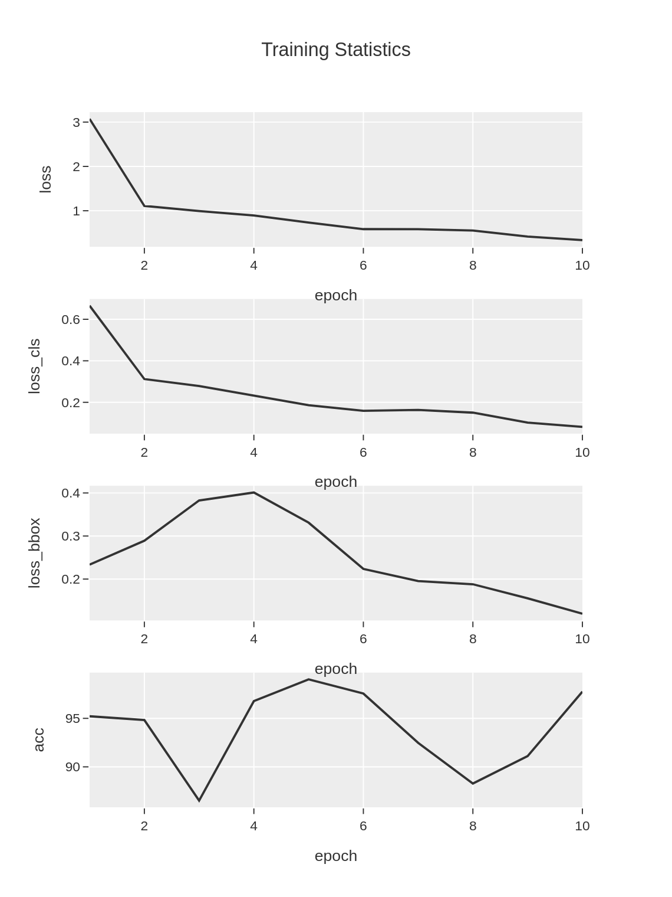
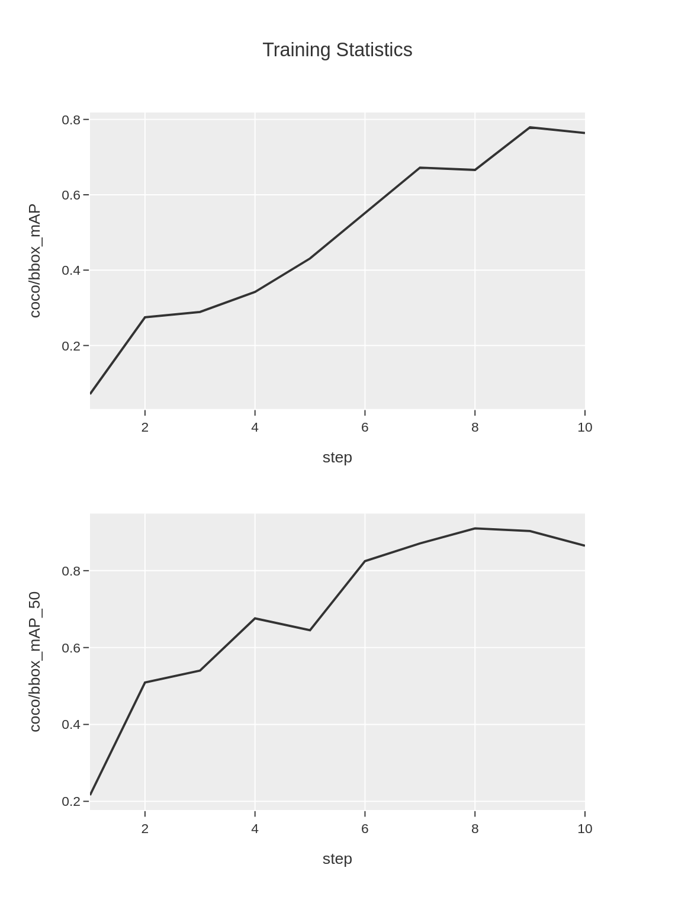
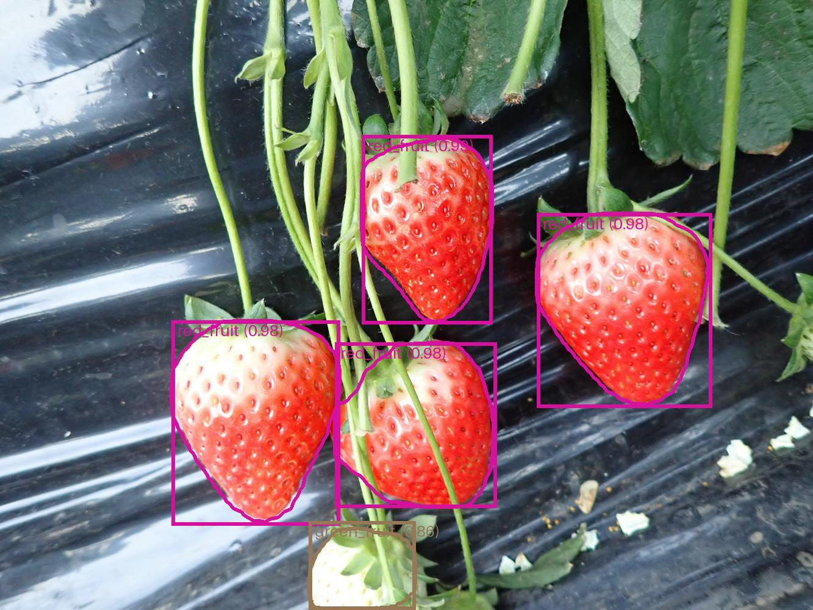
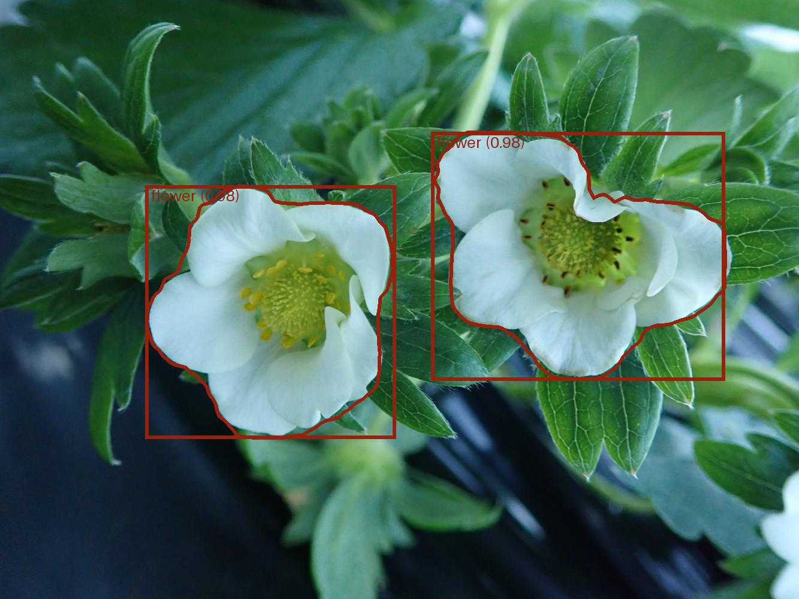

Instance Segmentation
#####################

Instance segmentation determines a pixel-wise mask for each object in an image.
This tutorial explains how to generate source code
for instance segmentation tasks using the cvtk package,
train a model to perform instance segmentation,
and run inference with the trained model.
The overall workflow and even the generated source code are very similar to that of object detection.

.. note::

    The **cvtk** package internally uses functions from
    **torch** (`PyTorch <https://pytorch.org/>`_),
    **mmcv** (`MMCV <https://mmcv.readthedocs.io/en/latest/>`_),
    and **mmdet** (`MMDetection <https://mmdetection.readthedocs.io/en/latest/>`_) packages
    for instance segmentation tasks.
    Make sure that **torch**, **mmdet**, and **mmcv** are installed correctly
    without any errors before using **cvtk**.

    .. code:: python

        import torch
        import mmcv
        import mmdet
        print(f"torch {torch.__version__}")
        print(f"mmcv {mmcv.__version__}")
        print(f"mmdet {mmdet.__version__}")

Preparation
***********

The ``cvtk create`` command can automatically generate Python source code for instance segmentation.

.. code-block:: sh
    
    cvtk create --script segm.py --task segm

This command generates a file named :file:`segm.py`,  
which contains simple source code for instance segmentation.  
All complex functionality is imported from the **cvtk** package,  
making the script easier to read and helping beginners understand the deep learning workflow.

By default, the Mask RCNN model (``mask-rcnn_r101_fpn_1x_coco``) is used.  
Users can replace this with any other supported model by editing the generated script.  
Available network architectures can be found in the MMDetection GitHub repository  
(e.g., `mmdetection.configs <https://github.com/open-mmlab/mmdetection/tree/main/configs>`_)  
or by running the ``mim search`` command (e.g., ``mim search mmdet --model "mask-rcnn"``).

For users already familiar with deep learning,
it is recommended to run ``cvtk create`` with the ``--vanilla`` argument.

.. code-block:: sh
    
    cvtk create --script segm.py --task segm --vanilla

This generates a script that uses only **torch** and **mmdet** functions without relying on **cvtk**.
Such a script can be shared with users who do not have **cvtk** installed or further customized,
for example, by adding data augmentation or modifying the training loop.

.. note::

   The source code generated for instance segmentation is almost the same as that for object detection,  
   since both are based on the **mmdet** framework. The key differences are:

   - **Network architecture**: instance segmentation uses Mask RCNN (``mask-rcnn_r101_fpn_1x_coco``),  
     while object detection uses Faster RCNN (``faster-rcnn_r101_fpn_1x_coco``).  
   - **Annotations**: instance segmentation requires segmentation masks (pixel-level polygons),  
     while object detection only requires bounding box coordinates.

Model Training and Validation
*****************************

Training and validation can be performed by executing the generated source code,
providing the training, validation, and test datasets along with the label file as follows.
Note that the datasets must be in COCO format with segmentation mask coordinates.

.. code-block:: sh

    python det.py train \
        --label ./data/strawberry/label.txt \
        --train ./data/strawberry/train/segm.json \
        --valid ./data/strawberry/valid/segm.json \
        --test ./data/strawberry/test/segm.json \
        --output_weights ./outputs/strawberry.pth

The trained model weights will be saved in :file:`strawberry.pth`.
During training, loss and accuracy logs will be stored in
:file:`strawberry.train_stats.train.txt` and :file:`strawberry.train_stats.valid.txt`,
along with visualization figures generated from these files.
Both text files are tab-separated, for example:

:file:`strawberry.train_stats.train.txt`

::

    epoch	lr	data_time	loss	loss_rpn_cls	loss_rpn_bbox	loss_cls	acc	loss_bbox	loss_mask	time	memory
    1	0.00118	0.03453	1.84487	0.03162	0.01490	0.59783	88.37890625	0.3763710225621859	0.8241304568946362	0.4096731980641683	5721.0
    2	0.00238	0.01690	1.01754	0.01787	0.01174	0.31824	83.984375	0.4193130740523338	0.250374620705843	0.36697773933410643	5686.0
    3	0.00353	0.01563	0.72365	0.00546	0.01157	0.21473	87.59765625	0.3275810395181179	0.1643025816977024	0.35318960666656496	5757.0
    4	0.00478	0.01308	0.51533	0.00525	0.01162	0.15927	98.33984375	0.194721964225173	0.14444936953485013	0.37441123962402345	5804.0
    5	0.00598	0.01276	0.44866	0.00665	0.01034	0.12237	95.3125	0.17035995483398436	0.13892668940126895	0.36310056209564207	5728.0

:file:`strawberry.train_stats.train.png`

:file:`strawberry.train_stats.valid.txt`

::

    coco/bbox_mAP	coco/bbox_mAP_50	coco/bbox_mAP_75	coco/bbox_mAP_s	coco/bbox_mAP_m	coco/bbox_mAP_l	coco/segm_mAP	coco/segm_mAP_50	coco/segm_mAP_75	coco/segm_mAP_s	coco/segm_mAP_m	coco/segm_mAP_l	data_time	time	step
    0.345	0.507	0.399	-1.0	-1.0	0.345	0.412	0.507	0.466	-1.0	-1.0	0.413	0.1388627529144287	0.86514892578125	1
    0.352	0.614	0.345	-1.0	-1.0	0.352	0.5	0.614	0.581	-1.0	-1.0	0.501	0.012227217356363932	0.40663444995880127	2
    0.579	0.748	0.693	-1.0	-1.0	0.582	0.643	0.748	0.748	-1.0	-1.0	0.659	0.01785115400950114	0.23407896359761557	3
    0.642	0.785	0.785	-1.0	-1.0	0.642	0.72	0.785	0.785	-1.0	-1.0	0.75	0.018213987350463867	0.2121752897898356	4
    0.643	0.829	0.829	-1.0	-1.0	0.643	0.718	0.829	0.829	-1.0	-1.0	0.725	0.01665182908376058	0.18859827518463135	5

:file:`strawberry.train_stats.valid.png`

If test data is provided, the model will also be evaluated on it.
The inference results will be stored in the workspace (:file:`strawberry` directory)
as :file:`test_outputs.coco.json` in COCO format.
The test performance metrics (e.g., mAP) will be saved in :file:`strawberry.test_stats.json` in JSON format.
The ``stats`` element summarizes mean metrics across all classes,
while per-class results are stored under ``class_stats``:

::

    {
        "stats": {
            "AP@[0.50:0.95|all|100]": 0.8671538582429673,
            "AP@[0.50|all|1000]": 0.9365079365079365,
            "AP@[0.75|all|1000]": 0.9365079365079365,
            ...
            "AP@[0.50:0.95|large|1000]": 0.8671538582429673,
            "AR@[0.50:0.95|all|100]": 0.4738095238095238,
            "AR@[0.50:0.95|all|300]": 0.9029761904761905,
        },
        "class_stats": {
            "flower": {
                "AP@[0.50:0.95|all|100]": 0.9252475247524753,
                "AP@[0.50|all|1000]": 1.0,
                "AP@[0.75|all|1000]": 1.0,
                ...
            },
            "green_fruit": {
                "AP@[0.50:0.95|all|100]": 0.9665016501650165,
                "AP@[0.50|all|1000]": 1.0,
                "AP@[0.75|all|1000]": 1.0,
                ...
            },
            "red_fruit": {
                "AP@[0.50:0.95|all|100]": 0.7097123998114098,
                "AP@[0.50|all|1000]": 0.8095238095238095,
                "AP@[0.75|all|1000]": 0.8095238095238095,
                ...
            }
        }
    }

Inference
*********

Performing inference using the trained model can be done directly from the command line.
The target images should be specified with the ``--data`` argument,
which can be either a text file containing image paths (one path per line)
or a directory containing images.

.. code-block:: sh

    python segm.py inference \
        --label ./data/fruits/label.txt \
        --data ./data/fruits/test.txt \
        --model_weights ./outputs/strawberry.pth \
        --output ./outputs/inference_results

The inference results for each image (i.e., images with predicted segmentation masks)
will be saved in the :file:`inference_results` directory.
Additionally, a COCO format file containing all predicted annotations,
including bounding boxes and segmentation masks,
will be saved as :file:`instances.json`.
The following are examples of the output images.

